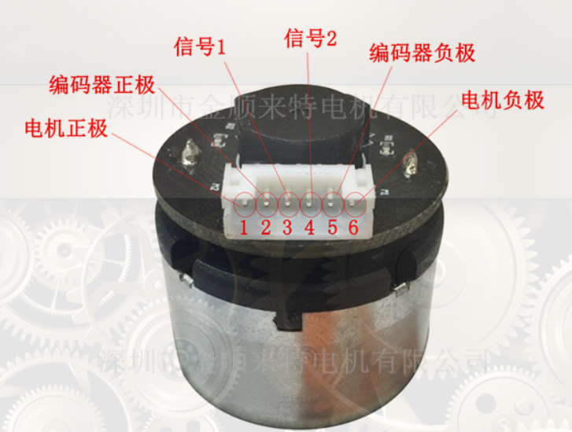
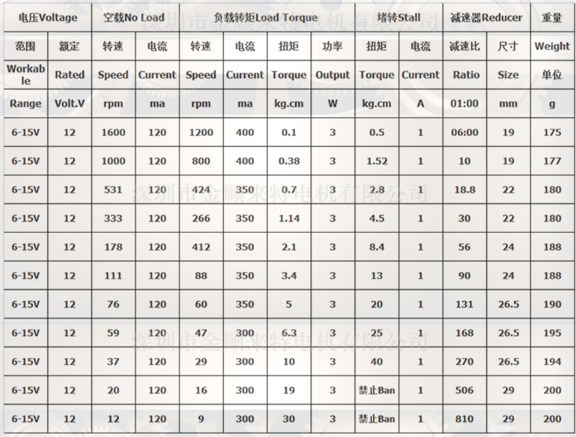

# AGV小车

## 0. 现阶段需求

最终目的为了完成工厂运输钢瓶的目的，现阶段想要实现一辆由手柄随动控制的AGV小车。

## 1. 硬件方案

### 1.1 全向轮方案

 全方位运动平台通常装有全向轮：**omni wheels（全向轮)** 或 **mecanum wheels（麦克纳姆轮)**。借助于横向移动和原地回旋的特性，全方位运动平台可方便的穿梭于狭窄拥挤空间中，灵活完成各种任务，相比传统移动平台有明显优势。 

<https://www.cnblogs.com/21207-iHome/p/7911748.html>

#### 1） 麦克纳姆轮（Mecanum Wheel）

麦克纳姆轮优点和缺点都是非常明确。采用麦克纳姆轮的车子大都移动异常灵活，机动性能非常好；但是这种轮胎的越野性能却非常差，跨越障碍的能力甚至不如普通轮胎，特别是当坡度较大的时候，甚至还会溜坡。所以配备这种车胎的设备大多是一些场地竞技机器人和室内仓储机器人等。

https://wenku.baidu.com/view/94f3c91717fc700abb68a98271fe910ef12dae8e.html?from=search
https://zhuanlan.zhihu.com/p/20282234?utm_source=qq&utm_medium=social 知乎专栏讲解
https://v.qq.com/x/page/o06206wwirk.html 直观动画演示

#### 2）全向轮（Omni Wheel）

### 1.2 机械结构方案

#### 1）悬挂系统设计

https://wenku.baidu.com/view/80e067aea0c7aa00b52acfc789eb172dec639950.html

因为原型车不将负重作为主要目的，暂且先不将负重的机械结构作为重点，原型车采用共轴悬挂。

### 1.3 电机方案

- JGB37-520带编码器减速直流电机，减速比1：30

### 1.4 测速编码器

- 减速电机自带的霍尔编码器，A/B相输出，基础11对极

### 1.5 机械尺寸

## 2. 电控方案

### 2.1 程序流程

### 2.2 硬件驱动

#### 2.2.1 SWD调试接口

#### 2.2.2 LED指示灯

#### 2.2.3 OLED显示

#### 2.2.4 按键模式检测

#### 2.2.5 串口驱动

#### 2.2.6 编码器

#### 2.2.7 AD/DA

#### 2.2.8 MPU6050/DMP

#### 2.2.9 电机

#### 2.2.10 flash读写

#### 2.2.11 PS2手柄驱动

#### 2.2.12 CAN通信

### 2.3 控制算法